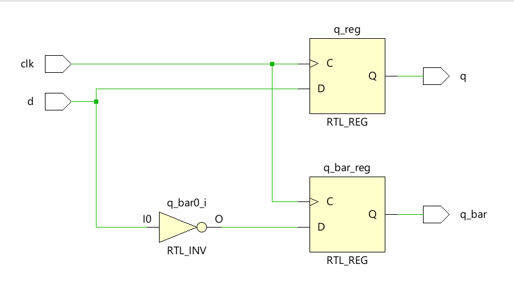
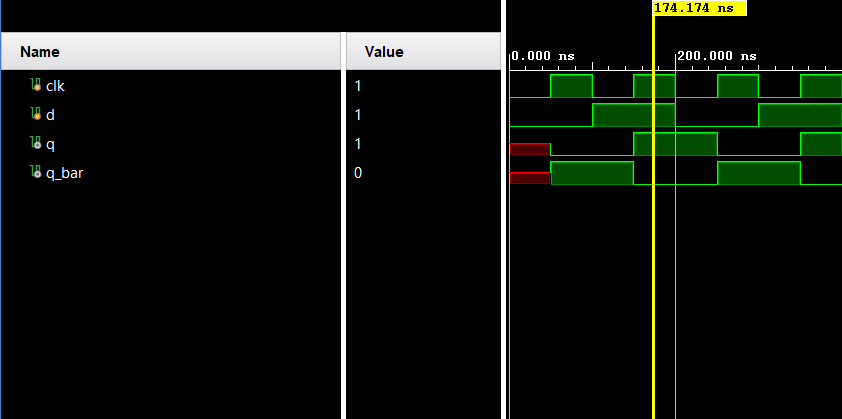

**Code**

```
module Code(
input d,
input clk,
output reg q,q_bar);
always @(posedge clk)
begin 
q<=d;
q_bar=~d;
end
endmodule
```

**Testbench**

```
module Testbench();
    reg clk,d;
    wire q,q_bar;
    Code uut(d,clk,q,q_bar);
    initial
    begin
    clk=0;
    forever #50 clk = ~clk;
    end
    initial begin
    d <= 0;
    #100;
    d <= 1;
    #100;
    d <= 0;
    #100;
    d <= 1;
    #100; $finish;
    end
endmodule
```

