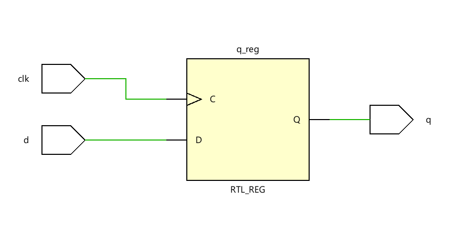
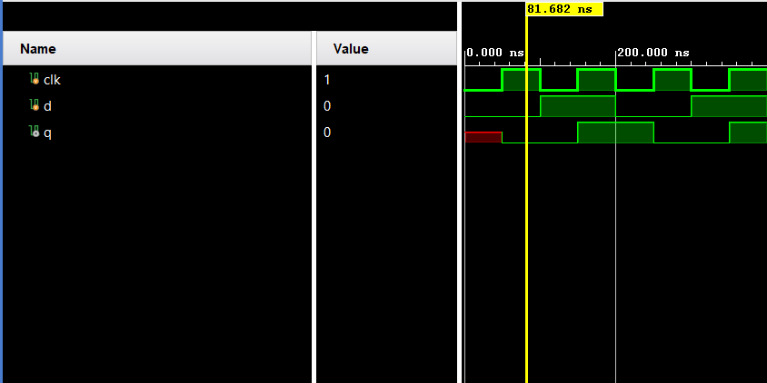

**Code**

```
module Code(d,clk,q);
input d;
input clk;
output reg q;
always @(posedge clk)
begin 
q<=d;
end
endmodule
```

**Testbench**

```
module Testbench();
    reg clk,d;
    wire q;
    Code uut(d,clk,q);
    initial
    begin
    clk=0;
    forever #50 clk = ~clk;
    end
    initial begin
    d <= 0;
    #100;
    d <= 1;
    #100;
    d <= 0;
    #100;
    d <= 1;
    #100; $finish;
    end

endmodule
```

