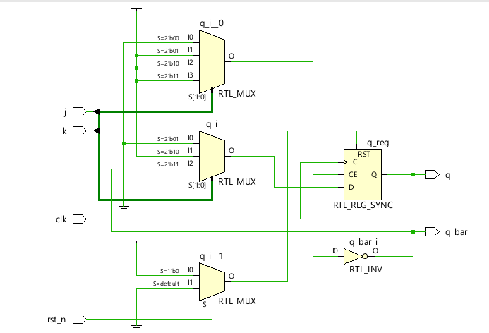

**Code**

```
module Code(
    input clk,
    input rst_n,
    input j,
    input k,
    output reg q,
    output q_bar
);

always @(posedge clk) begin
    if (!rst_n)
        q <= 1'b0;
    else begin
        case ({j, k})
            2'b00: q <= q;      // No change
            2'b01: q <= 1'b0;   // Reset
            2'b10: q <= 1'b1;   // Set
            2'b11: q <= ~q;     // Toggle
        endcase
    end
end

assign q_bar = ~q;

endmodule
```

**Testbench**

```
`timescale 1ns/1ps
module Testbench();
    reg rst_n,clk,j,k;
    wire q,q_bar;
    Code uut(clk,rst_n,j,k,q,q_bar);
    initial
    begin
    clk=0;
    forever #50 clk = ~clk;
    end
    initial begin
    rst_n <= 0;
    #100;
    rst_n <= 1; j <= 0; k <= 0;
    
    #100;
    rst_n <= 1; j <= 0; k <= 1;
    #100;
    rst_n <= 1; j <= 1; k <= 0;
    #100;
    rst_n <= 1; j <= 1; k <= 1;
    #100; $finish;
    end

endmodule
```

