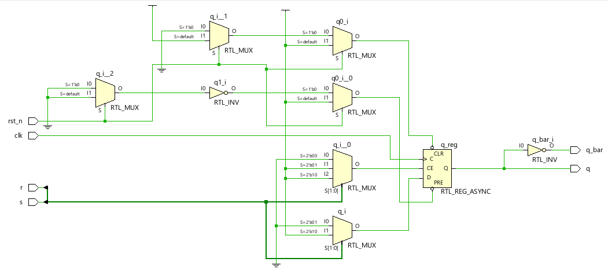
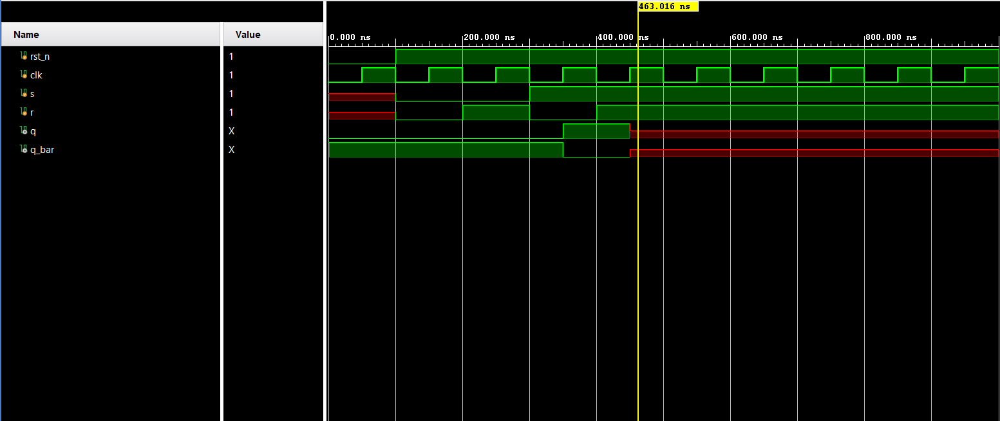

**Code**

```
module Code(
input clk,
input rst_n,
input s,
input r,
output reg q,
output q_bar
    );
    always @ (posedge clk or negedge rst_n)
    begin
    if (!rst_n)
    q= 1'b0;
    else begin
    case ({s,r})
    2'b00: q <= q;
    2'b01: q <= 1'b0;
    2'b10: q <= 1'b1;
    2'b11: q <= 1'bx;
    default: q<=q;
    endcase
    end
    end
    assign q_bar=~q;
    
    
endmodule
```

**Testbench**

```
`timescale 1ns/1ps

module Testbench();
    reg rst_n,clk,s,r;
    wire q,q_bar;
    Code uut(clk,rst_n,s,r,q,q_bar);
    initial
    begin
    clk=0;
    forever #50 clk = ~clk;
    end
    initial begin
    rst_n <= 0;
    #100;
    rst_n <= 1; s <= 0; r <= 0;
    
    #100;
    rst_n <= 1; s <= 0; r <= 1;
    #100;
    rst_n <= 1; s <= 1; r <= 0;
    #100;
    rst_n <= 1; s <= 1; r <= 1;
    end
endmodule
```

