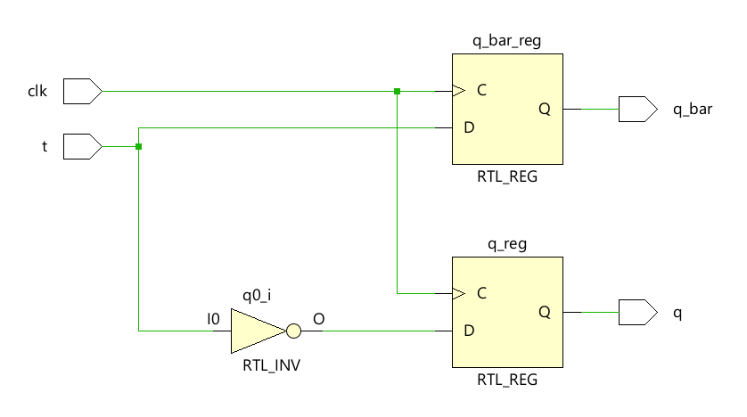

**Code**

```
module Code(
input wire t,clk,
output reg q,q_bar
    );
    always @(posedge clk)
    begin
    q=~t;
    q_bar=t;
    end 
endmodule
```

**Testbench**

```
module Testbench();
    reg clk,t;
    wire q,q_bar;
    Code uut(t,clk,q,q_bar);
    initial
    begin
    clk=0;
    forever #50 clk = ~clk;
    end
    initial begin
    t <= 0;
    #100;
    t <= 1;
    #100;
    t <= 0;
    #100;
    t <= 1;
    #100; $finish;
    end
endmodule
```

